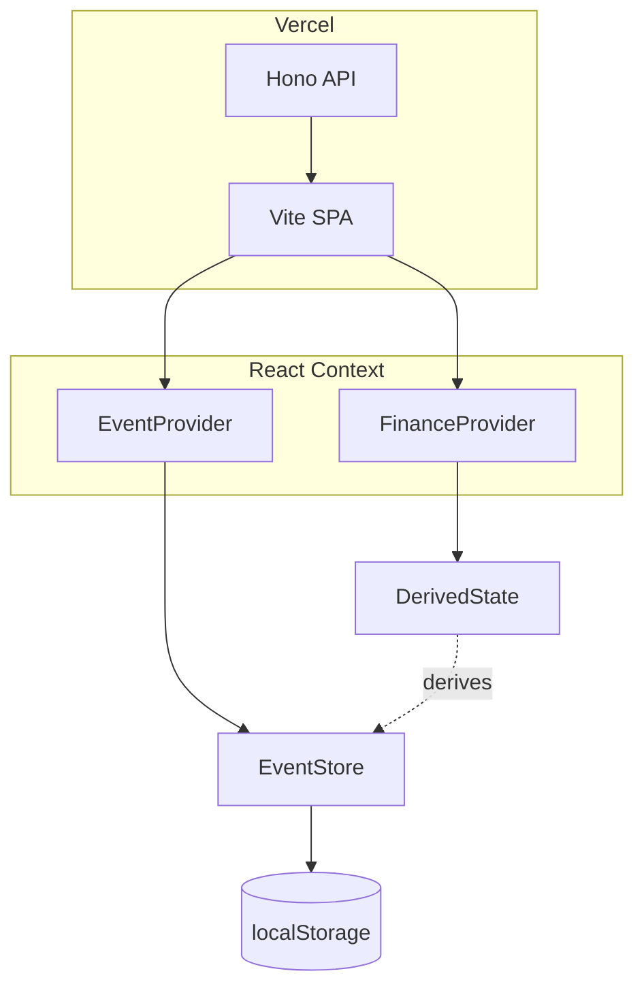

# Loan Advisor

## Stack

Node 22 · pnpm · TypeScript · Biome · Vite + React + Radix UI + React Router · Hono (Vercel serverless) · Recharts

## Architecture

## Event Sourcing

- **Single source of truth:** `EventStore` in `localStorage` (two slots: `dev` / `prod` mode).
- **Event types:** Defined in `src/types/events.ts` — `TakeMortgageEvent`, `TakePersonalLoanEvent`, `AddAssetEvent`, `BuyAssetEvent`, `AddIncomeEvent`, `AddExpenseEvent`, `ManualCorrectionEvent`, `RepayLoanEvent`.
- **Derived state:** `src/lib/deriveState.ts` applies events via `applyEvents` → `{ assets, liabilities, incomes, expenses }`. Recomputed on every store change.
- **Immutability:** All event handlers and reducers clone state; never mutate in place.

## Simulation

`src/lib/simulate.ts` projects forward in time:

1. Start from derived state at a given date
2. Step month-by-month: compute income, expenses, cash flow, asset growth, liability amortization
3. Detect loan payoff → expenses drop from that month onward
4. Return array of `MonthSnapshot` for charting

Used by Strategy Simulator (`/simulator`) to compare two scenarios side-by-side.

## Code Style

- **Avoid classes:** Prefer pure functions and custom hooks.
- **Type imports:** Use `import type { ... }` when importing only for type annotations.
- **Currency handling:** All money is `{ amount: number, currency: Currency }`. No naked numbers for financial values in domain logic.
- **Event builders:** `src/lib/eventBuilders.ts` constructs valid event payloads with defaults and ID generation.

## Documentation Guidelines

- Only document what is NOT deducible from code or framework docs.
- Never duplicate Radix UI, React Router, or Recharts docs.
- **AGENTS.md files** contain only: domain rules, invariants, non-obvious constraints, and workflow conventions.
- Code examples in docs must be minimal skeletons showing the pattern.
- **README** covers setup / deploy only. Architecture lives here.
- **spec/** holds diagrams, features, and requirements. Keep `spec/diagram/*.puml` in sync with `src/types/*.ts` (see `spec/AGENTS.md`).
